# MomentsHub 

MomentsHub is an upgraded social media application designed to foster connections and facilitate the sharing of moments and experiences among users. With an enhanced feature set and seamless user experience, MomentsHub aims to redefine social networking by prioritizing interaction and personalization.

## Features

1. Splash Screen: Experience an eye-catching splash screen upon launching MomentsHub, setting the stage for a captivating journey through the app.

2. Sign Up and Login: Seamlessly create an account or log in using your phone number, email, or through Google authentication, ensuring a hassle-free onboarding process.

3. Home Page: Discover a diverse array of posts, reels, and saved content from creators across various topics, ensuring you stay updated on the latest trends and happenings in your network.

4. Search Feature: Easily find and connect with users by searching for their usernames or names, facilitating the discovery of new accounts to follow and engage with.

5. Profile Customization: Personalize your profile by editing your username, name, profile picture, and bio, allowing you to showcase your identity and interests to the MomentsHub community.

6. Follow and Unfollow: Follow other users to stay updated on their content and unfollow them at any time to tailor your feed to your preferences.

7. Upload and Post: Share your moments with the world by uploading posts, reels, and saved content directly from your device, enabling you to express yourself creatively and authentically.

8. Like and Share: Engage with fellow users by liking and sharing their posts and reels, fostering community interaction and connection within MomentsHub.

9. Save and Bookmark: Save posts and reels that resonate with you for later viewing, ensuring you can revisit your favorite content whenever you desire.

10. Messaging: Communicate with other users through text or image messages, facilitating private conversations and connections within the MomentsHub community.

11. Logout Option: Securely log out of your account to ensure the privacy and security of your MomentsHub profile and data.

12. Profile Update: Easily update your profile information and settings to reflect any changes in your identity or preferences.

## Technology

1. XML: MomentsHub utilizes XML to create visually appealing and consistent user interfaces, enhancing the overall user experience and ensuring a polished look and feel throughout the app.

2. Kotlin: Built with Kotlin, MomentsHub benefits from the language's efficiency and developer-friendly syntax, enabling smooth performance and streamlined development processes for enhanced productivity.

3. Android Studio: Developed using Android Studio, MomentsHub leverages the powerful tools and functionalities the official IDE provides for Android app development.

4. Firebase: MomentsHub integrates Firebase for backend services, including authentication, real-time database, cloud storage, and more, ensuring a robust and scalable infrastructure for the application.

## Screenshots

    
    
SplashScreen

    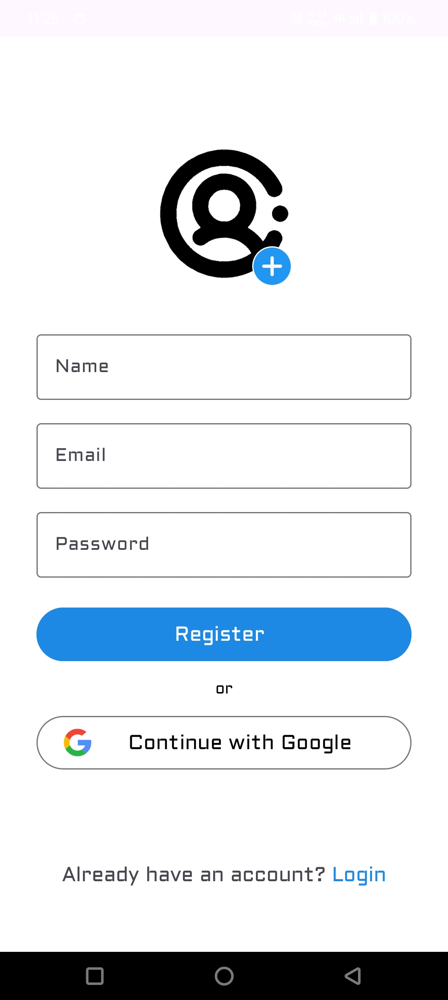
    
SignUp Screen

    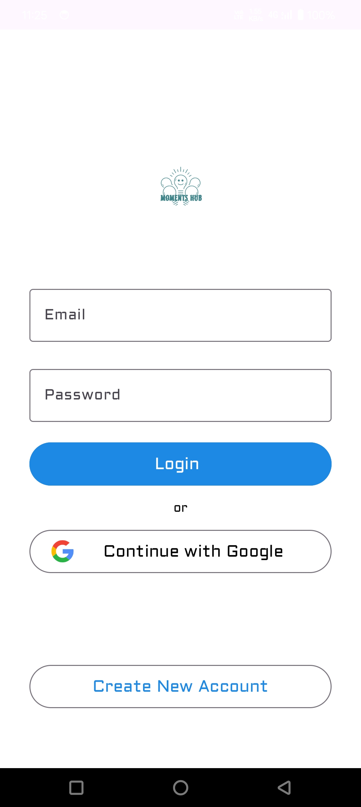
    
Login Screen

    
    
Search Screen

    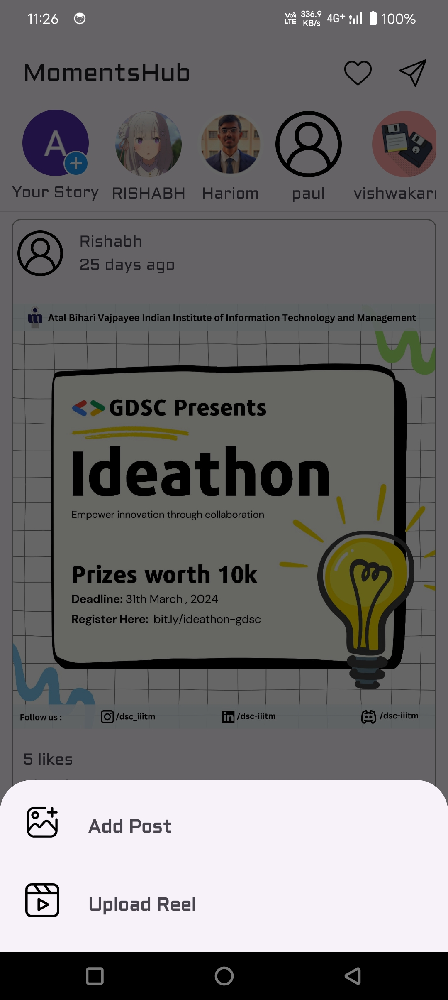
    
Add Screen

    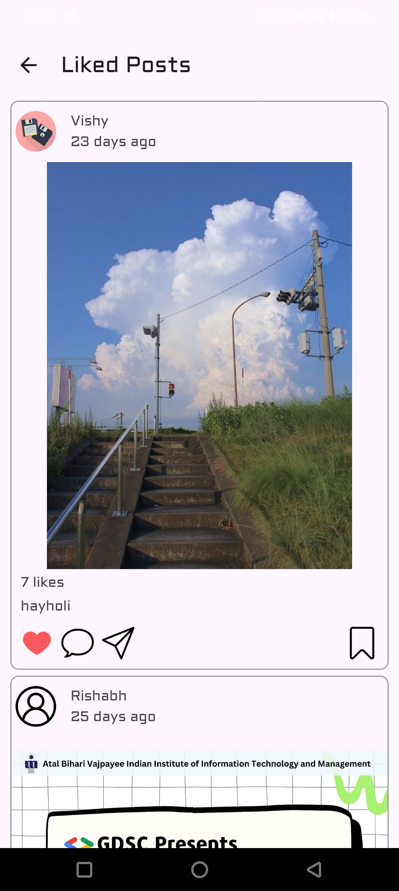
    
Liked Screen

    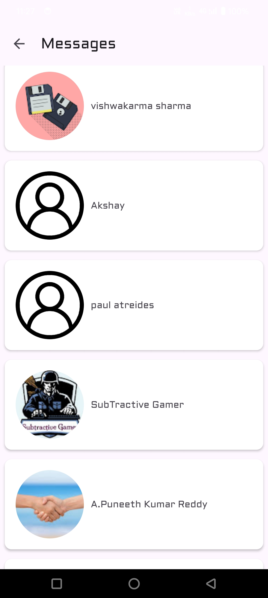
    
Message Screen

    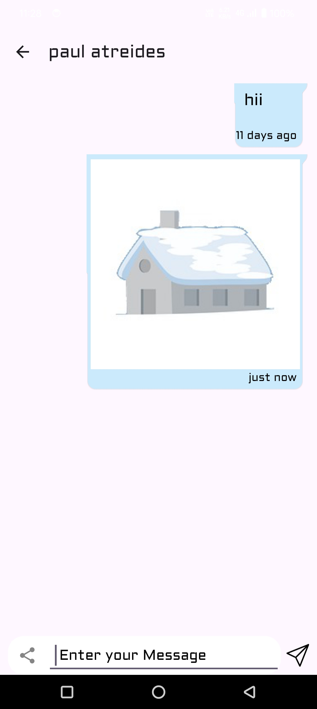
    
Chat Screen

    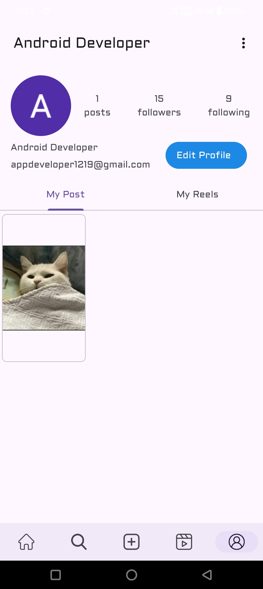
    
Profile Screen

    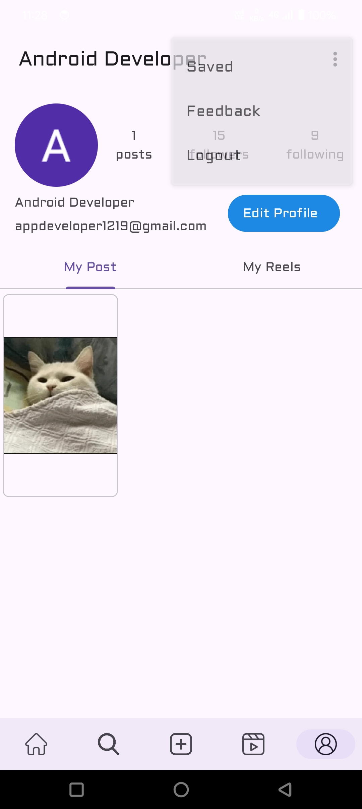
    
Menu Options

    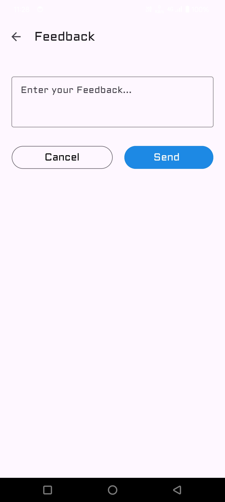
    
Feedback Screen

    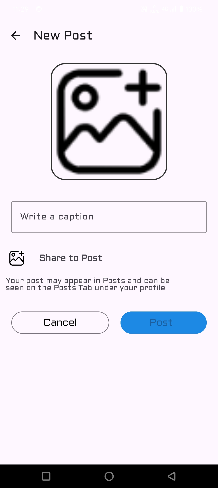
    
Post-Upload Screen

    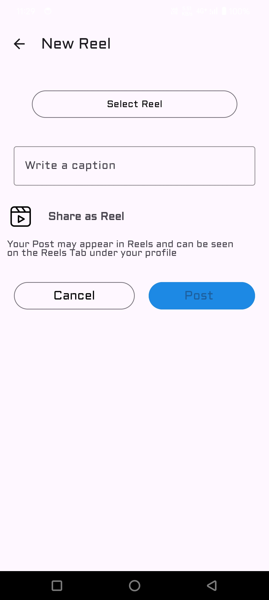
    
Reel-Upload Screen

    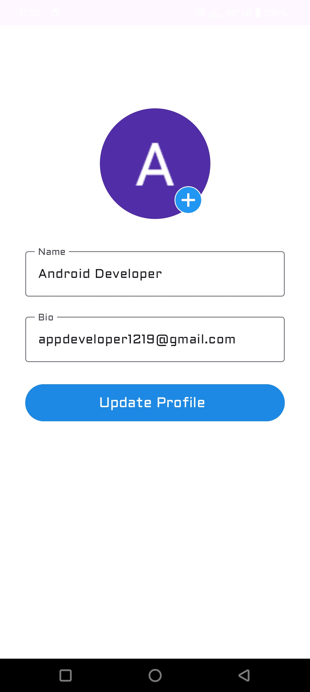
    
Profile-Update Screen

    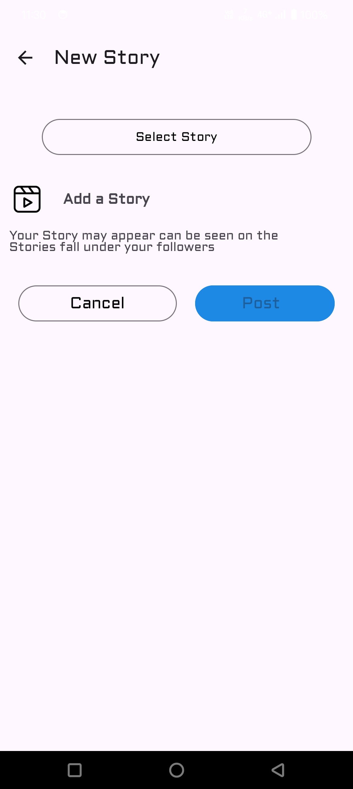
    
Story-Upload Screen

    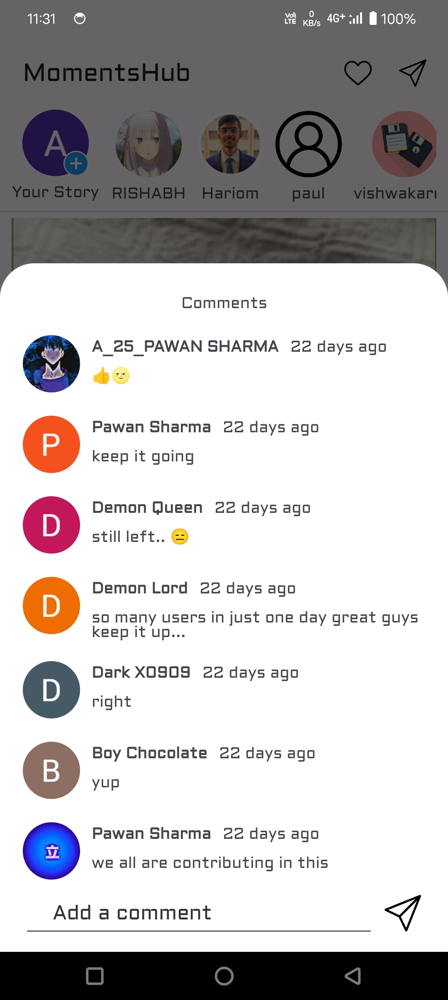
    
Comment Dialog

    
    
Home Screen

    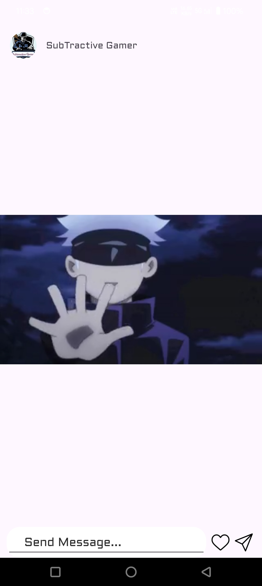
    
Story Screen

    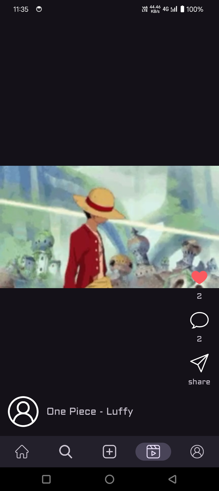
    
Reel Screen

## Get Started

To start exploring MomentsHub and connecting with others through shared moments, download the app from the App Store or Google Play Store and create your account today! Join our vibrant community and embark on a journey of discovery, creativity, and connection.

[Download MomentsHub](https://play.google.com/store/apps/details?id=com.pvsrishabh.momentshub)

## Feedback

We're committed to continually improving MomentsHub and enhancing your social media experience. If you have any feedback, suggestions, or encounter any issues while using the app, please reach out to our support team. Your input is invaluable as we strive to make MomentsHub the best it can be for our users.

Thank you for choosing MomentsHub! We look forward to sharing unforgettable moments with you.
